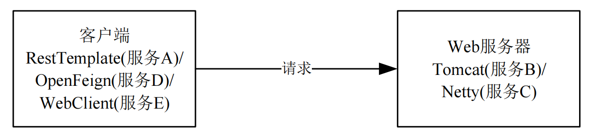

# Mtls Example

## 项目说明

本项目演示如何利用 Istio 下发的证书实现Spring Cloud Alibaba（下文简称：SCA）应用之间的双向TLS能力。目前对于服务端支持Spring MVC以及Spring WebFlux应用的适配，并针对feign，resttemplate等客户端的实现，提供了具有热更新能力的ssl上下文，配置后可自动进行istio证书的更新。

## 准备

### 安装K8s环境

请参考K8s的[安装工具](https://kubernetes.io/zh-cn/docs/tasks/tools/)小节。

### 在K8s上安装并启用Istio

请参考Istio官方文档的[安装](https://istio.io/latest/zh/docs/setup/install/)小节。

## 示例

### 如何接入

在启动示例进行演示之前，先了解一下应用如何接入Istio并及加载证书。 注意本章节只是为了便于理解接入方式，本示例代码中已经完成接入工作，您无需再进行修改。

1. 修改`pom.xml`文件，引入Istio规则Adapter以及mtls模块:

```xml
<dependency>
    <groupId>com.alibaba.cloud</groupId>
    <artifactId>spring-cloud-starter-xds-adapter</artifactId>
</dependency>
<dependency>
    <groupId>com.alibaba.cloud</groupId>
    <artifactId>spring-cloud-starter-mtls</artifactId>
</dependency>
```

2. 参照[文档](https://github.com/alibaba/spring-cloud-alibaba/blob/2.2.x/spring-cloud-alibaba-docs/src/main/asciidoc-zh/governance.adoc)，实现与`Istio`控制面的对接

### 效果演示



下面以RestTemplate客户端及Tomcat服务器为例，给出简单的使用示例。

通过如下命令加载具有热更新能力的SSL上下文：

```shell
curl -k https://localhost:8111/checkpreload
```

通过RestTemplate客户端请求Tomcat服务器：

```shell
curl -k https://localhost:8111/a/getB
```

请求成功，Tomcat服务器将会收到客户端所携带的证书：

```
[
[
  Version: V3
  Subject: CN=spiffe://cluster.local/ns/default/sa/bookinfo-details
  Signature Algorithm: SHA256withRSA, OID = 1.2.840.113549.1.1.11

  Key:  Sun EC public key, 256 bits
  public x coord: 33149052437996702917203301248564233359218522693018868733363521435635068976534
  public y coord: 22162767797646080301955127443011211147411180627709155379353395929020405902413
  parameters: secp256r1 [NIST P-256, X9.62 prime256v1] (1.2.840.10045.3.1.7)
  Validity: [From: Mon Sep 25 12:09:25 GMT+08:00 2023,
               To: Tue Sep 26 12:11:25 GMT+08:00 2023]
  Issuer: O=cluster.local
  SerialNumber: [    8cc7f217 1295d26f f3a3ac19 acfd4128]

Certificate Extensions: 5
[1]: ObjectId: 2.5.29.35 Criticality=false
AuthorityKeyIdentifier [
KeyIdentifier [
0000: 9D 4E 93 61 65 5B 47 8B   E5 B4 1D 6C A7 06 9E 35  .N.ae[G....l...5
0010: AD 9B 8A 0B                                        ....
]
]

[2]: ObjectId: 2.5.29.19 Criticality=true
BasicConstraints:[
  CA:false
  PathLen: undefined
]

[3]: ObjectId: 2.5.29.37 Criticality=false
ExtendedKeyUsages [
  serverAuth
  clientAuth
]

[4]: ObjectId: 2.5.29.15 Criticality=true
KeyUsage [
  DigitalSignature
  Key_Encipherment
]

[5]: ObjectId: 2.5.29.17 Criticality=true
SubjectAlternativeName [
  URIName: spiffe://cluster.local/ns/default/sa/bookinfo-details
]

]
  Algorithm: [SHA256withRSA]
  Signature:
0000: 1D 0B 0A B3 D3 7D 94 9A   7B A2 0F 32 EC F5 F4 BD  ...........2....
0010: B0 94 3A 83 51 0C 1F B8   2B 1F D5 31 D4 2F E6 08  ..:.Q...+..1./..
0020: 01 F6 7F 68 35 02 ED 4A   C4 07 58 FC 4C 14 0C 79  ...h5..J..X.L..y
0030: 12 1F 6E 68 CC 4B 04 C8   1E B4 32 01 1D 34 2A 34  ..nh.K....2..4*4
0040: 0A DA 7B 07 82 05 1A E2   25 F6 4F E6 C8 1B B8 B5  ........%.O.....
0050: 7F E1 57 DF C3 32 95 ED   CD B4 C0 83 ED EA 4C 76  ..W..2........Lv
0060: 38 15 F3 DC 81 C9 4B A0   2C FA A5 71 82 00 A3 FF  8.....K.,..q....
0070: 6E 1D 4C B1 64 06 E3 BC   D1 EC D2 1E 9D 50 B9 EA  n.L.d........P..
0080: 2C 58 23 32 E6 8E 88 2C   66 B9 EA B3 F0 9D 9B 15  ,X#2...,f.......
0090: 90 3D 94 B6 AB 09 BC 99   9A 0D F6 74 57 BA 0D 7E  .=.........tW...
00A0: 96 DC B2 79 22 36 EB BA   7A A3 D0 12 82 A2 E9 17  ...y"6..z.......
00B0: F6 A9 49 74 16 32 29 BE   BF 56 66 F0 93 E7 5D 37  ..It.2)..Vf...]7
00C0: 67 DC 25 F3 16 E7 6A C3   09 F7 EB A1 01 4E EF 84  g.%...j......N..
00D0: 2E 84 34 1C A8 34 87 6D   87 4B 2B 4D 06 8B 30 BA  ..4..4.m.K+M..0.
00E0: 6F FF DF 05 62 33 B9 62   F6 26 BF 51 D6 2C 87 8D  o...b3.b.&.Q.,..
00F0: E1 0D 7E 56 F0 CA 87 79   39 9C 0F 10 AA 2D AF 02  ...V...y9....-..

]
```

可以通过以下命令加载本地证书，更新证书配置：

```shell
curl -k https://localhost:8111/reload
```

